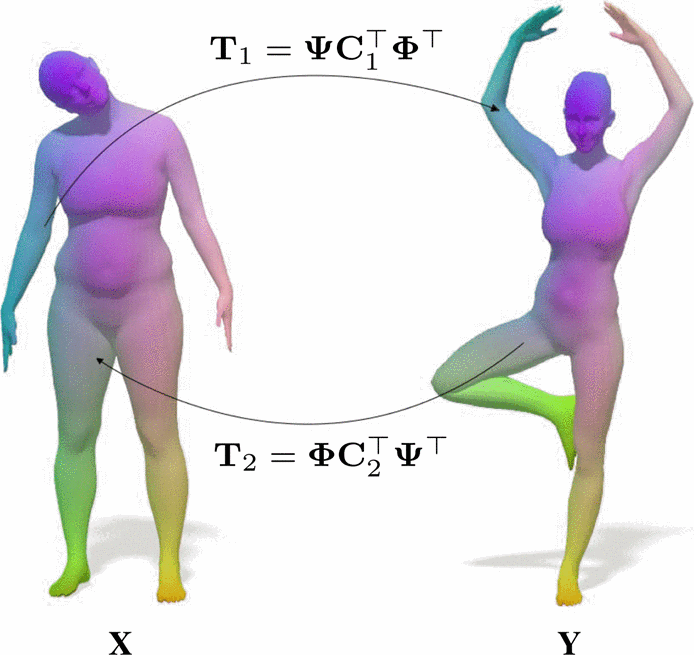

# Partial Deformable Shape Correspondence




Code Submission to **Deformable Shapes** for the course **Case Studies: Nonlinear Optimization** at TUM [\[report\]]() [\[poster\]](docs/poster.pdf)

**Authors:** Bodo Lipp, Niklas Lüdtke, Pietro Massetani, Binlan Wu (equal contribution)

## Data
------

We used various data sources. You can find the publicly available datasets in the following table.

> **_NOTE:_** Only dataloaders for TOSCA and Shrec 16' are implemented!

|  Data | Website  |
|---|---|
|  FAUST | http://faust.is.tue.mpg.de  |
|  TOSCA |  https://vision.in.tum.de/data/datasets/partial |
| Shrec 16' | https://www.dais.unive.it/~shrec2016/dataset.php |
| CP2P | https://github.com/pvnieo/cp2p-pfarm-benchmark/tree/master/cp2p |
| PFARM | https://github.com/pvnieo/cp2p-pfarm-benchmark/tree/master/pfarm |

The default location for the data folders in all files & notebooks is **two** levels above the root code folder!

## Installation
------------

(1) Create your Virtual Environment

    conda create -n shape_correspondence
    conda activate shape_correspondence

(2) Install requirements

    pip install -r requirements.txt


## pyFM
-----------
[\[repo\]](https://github.com/RobinMagnet/pyFM)

The basic functionalities of the pyFM package are displayed in the pyfm_example_notebook file.

## DPFM
-----------
[\[repo\]](https://github.com/pvnieo/DPFM) [\[paper\]](http://www.lix.polytechnique.fr/~maks/papers/DPFM_3DV2021.pdf)

Implementation of the DPFM network to train descriptors.
One can train and evaluate standart DPFM models with two simple commands show in the following sections. 

### Unsupervised variant of DPFM
We also implemented an unsupervised version of DPFM, which only uses the inherant structure of the descriptors and functional maps in the loss and does not need labelled training data. 

## DPCFM
---------
There are two version available. The structures can be found in the following diagrams (more details can be found in the report)


Our proposed DPCFM structure is implemented based on the DPFM code. Wee provide training and evaaluation scripts, just like for the other models.


## Training
-----------
All of the models mentioned above can be trained using the *run_training.py* script. To choose the model use the flag *-v* and choose one of the following 
- dpfm
- unsupervised
- dpcfm1
- dpcfm2

Other flags exist to set the paths to the data, config file, etc. Use *-h* to see all available options.

**Example:**
```
python3 run_training.py -d ../.. -c project/config/tosca_cuts.yaml
```

The state dicts from the PyTorch models are saved in 
    
    project/data/{cfg.dataset.model_name}

They are saved every 5 epochs, you can change that behaviour in the config file.

## Evaluation
----------
Trained models can be evaluated with the *run_eval.py* script. You have to choose the correct model again and use the other flags to give your respective paths again. Use *-h* to see all available options.

**Example:**
```
python3 run_eval.py  -d ../.. -c project/config/tosca_cuts.yaml -mp project/models/dpcfm.pth -m CFM
```

We provide pretrained models that can be used for evaluation and recreating the experiments seen in the report. The state dicts can be found in the folder

    project/models

> **Note:** For evaluating DPCFM models with coupled functional maps, use the dpfm model, i.e. *-v dpfm*

## Acknowledgements
--------
This work is based significantly on [DPFM](https://github.com/pvnieo/DPFM) (Copyright (c) 2021 Souhaib Attaiki, Gautam Pai and Maks Ovsjanikov) and [pyFM](https://github.com/RobinMagnet/pyFM) (Robin Magnet). 

A special thanks to Lennart Bastian, Fabian Schaipp and Mahdi Saleh for their helpful discussions and comments.

This work is distributed under 
a [Creative Commons Attribution-NonCommercial-ShareAlike 3.0 Unported License](https://creativecommons.org/licenses/by-nc-sa/3.0/).